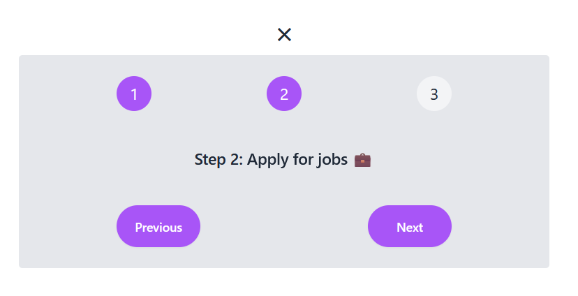
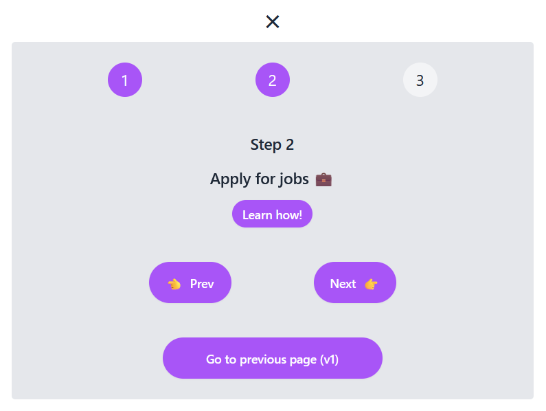

# Overview

This project has been created as part of the Ultimate React Course by Jonas Schmedtmann. It has been adapted and created with Vite, TypeScript and Tailwind **instead** of imported CSS, Create-React-App (webpack) and JavaScript which was used in the course.

## Project

This is made up of two parts, v1 and v2.

The purpose of V1 is to make a basic component with props, state and some handlers and to use tailwind for styling.

The purpose of v2 is instead to expand on the first version and also make use the children prop to render input from the user into a component.

The project makes use of react-router-dom for some basic routing.

## Images

**Steps v1**

**Steps v2**

